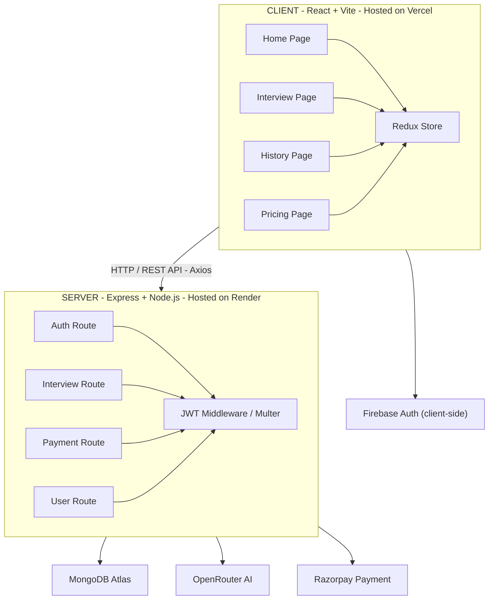

<h1 align="center">
  
</h1>

<h3 align="center">🤖 Practice Interviews with AI Intelligence</h3>

<p align="center">
  <strong>An AI-powered mock interview platform with smart follow-ups, adaptive difficulty, and real-time performance evaluation.</strong>
</p>

<p align="center">
  <a href="https://ai-interview-agent-two-tawny.vercel.app/">
    
  </a>
  &nbsp;
  <a href="https://github.com/sahastraWin/AI-Interview-Agent">
    
  </a>
  &nbsp;
  <a href="https://ai-interview-agent-uirj.onrender.com/">
    
  </a>
</p>

---

## 📸 Features at a Glance

| Feature | Description |
|--------|-------------|
| 🎭 Role-based Questions | Choose your target role and experience level |
| 🎙️ Smart Voice Interview | Dynamic follow-up questions based on your answers |
| 📊 Performance Analytics | Detailed score breakdown with feedback |
| 🔐 Google Authentication | Secure sign-in with Firebase |
| 💳 Credit System | Razorpay-powered premium credits |
| 📄 Resume Analysis | AI parses your resume to tailor questions |

---

## 🏗️ System Architecture



---

## 🛠️ Tech Stack

### 🖥️ Frontend
| Technology | Purpose |
|-----------|---------|
|  | UI Framework |
|  | Build Tool & Dev Server |
|  | Styling |
|  | Global State Management |
|  | Client-Side Routing |
|  | HTTP Client |
|  | Google Authentication |
|  | Performance Charts |
|  | PDF Report Generation |
|  | Animations |

### ⚙️ Backend
| Technology | Purpose |
|-----------|---------|
|  | Runtime |
|  | Web Framework |
|  | Database |
|  | ODM for MongoDB |
|  | Authentication Tokens |
|  | Resume File Uploads |
|  | PDF Text Extraction |
|  | Dev Auto-Restart |

### 🌐 External Services & APIs
| Service | Purpose |
|---------|---------|
| 🤖 **OpenRouter AI** | Generates interview questions & evaluates answers |
| 🍃 **MongoDB Atlas** | Cloud database hosting |
| 🔥 **Firebase** | Google OAuth authentication |
| 💳 **Razorpay** | Payment gateway for credits |
| 🟢 **Vercel** | Frontend deployment & CDN |
| 🎯 **Render** | Backend server hosting |

---

## 📁 Project Structure

```
AI-Interview-Agent/
├── client/                      # React Frontend
│   └── src/
│       ├── components/
│       │   ├── AuthModel.jsx       # Login Modal
│       │   ├── Navbar.jsx          # Navigation Bar
│       │   ├── Footer.jsx          # Footer
│       │   ├── Step1SetUp.jsx      # Interview Setup Step
│       │   ├── Step2Interview.jsx  # Active Interview Step
│       │   ├── Step3Report.jsx     # Results/Report Step
│       │   └── Timer.jsx           # Countdown Timer
│       ├── pages/
│       │   ├── Home.jsx            # Landing Page
│       │   ├── Auth.jsx            # Authentication Page
│       │   ├── InterviewPage.jsx   # Main Interview Flow
│       │   ├── InterviewHistory.jsx
│       │   ├── InterviewReport.jsx
│       │   └── Pricing.jsx
│       ├── redux/
│       │   ├── store.js
│       │   └── userSlice.js
│       ├── utils/
│       │   └── firebase.js         # Firebase Config
│       └── App.jsx
│
└── server/                      # Express Backend
    ├── config/
    │   ├── connectDb.js            # MongoDB Connection
    │   └── token.js                # JWT Helper
    ├── controllers/
    │   ├── auth.controller.js
    │   ├── interview.controller.js
    │   ├── payment.controller.js
    │   └── user.controller.js
    ├── middlewares/
    │   ├── isAuth.js               # JWT Verification
    │   └── multer.js               # File Upload Config
    ├── models/
    │   ├── user.model.js
    │   ├── interview.model.js
    │   └── payment.model.js
    ├── routes/
    │   ├── auth.route.js
    │   ├── interview.route.js
    │   ├── payment.route.js
    │   └── user.route.js
    ├── services/
    │   ├── openRouter.service.js   # AI Integration
    │   └── razorpay.service.js     # Payment Integration
    └── index.js                    # Server Entry Point
```

---

## 🗄️ Database Models

### 👤 User Model
```js
{
  name: String,         // User's full name
  email: String,        // Unique email (from Google)
  credits: Number,      // Default: 100 free credits
  timestamps: true
}
```

### 🎙️ Interview Model
```js
{
  userId: ObjectId,     // Reference to User
  role: String,         // e.g., "Software Developer"
  experience: Number,   // Years of experience
  mode: "HR" | "Technical",
  resumeText: String,   // Parsed text from uploaded PDF
  questions: [{
    question: String,
    difficulty: String,
    timeLimit: Number,
    answer: String,     // User's submitted answer
    feedback: String,   // AI-generated feedback
    score: Number,
    confidence: Number,
    communication: Number,
    correctness: Number
  }],
  finalScore: Number,
  status: "Incompleted" | "completed",
  timestamps: true
}
```

---

## 🚀 API Endpoints

### 🔐 Auth (`/api/auth`)
| Method | Endpoint | Description |
|--------|----------|-------------|
| `POST` | `/google` | Sign in / Register with Google OAuth |
| `POST` | `/logout` | Logout & clear cookie |

### 👤 User (`/api/user`)
| Method | Endpoint | Description |
|--------|----------|-------------|
| `GET` | `/current-user` | Get logged-in user data |

### 🎙️ Interview (`/api/interview`)
| Method | Endpoint | Description |
|--------|----------|-------------|
| `POST` | `/create` | Create a new interview session |
| `GET` | `/history` | Get all past interviews |
| `GET` | `/:id` | Get a specific interview |
| `POST` | `/:id/answer` | Submit answer to a question |

### 💳 Payment (`/api/payment`)
| Method | Endpoint | Description |
|--------|----------|-------------|
| `POST` | `/create-order` | Create a Razorpay order |
| `POST` | `/verify` | Verify payment & add credits |

---

## ⚡ Local Setup Guide

### Prerequisites
- Node.js v18+
- MongoDB Atlas account
- OpenRouter API key
- Firebase project (Google Auth enabled)
- Razorpay account (Test Mode)

### 1️⃣ Clone
```bash
git clone https://github.com/sahastraWin/AI-Interview-Agent.git
cd AI-Interview-Agent
```

### 2️⃣ Backend Setup
```bash
cd server
npm install
```
Create `server/.env`:
```env
PORT=8000
MONGODB_URL=your_mongodb_connection_string
JWT_SECRET=your_random_secret_key
OPENROUTER_API_KEY=your_openrouter_api_key
RAZORPAY_KEY_ID=your_razorpay_key_id
RAZORPAY_KEY_SECRET=your_razorpay_key_secret
```
```bash
npm run dev   # http://localhost:8000
```

### 3️⃣ Frontend Setup
```bash
cd ../client
npm install
```
Create `client/.env`:
```env
VITE_FIREBASE_APIKEY=your_firebase_api_key
VITE_RAZORPAY_KEY_ID=your_razorpay_key_id
```
```bash
npm run dev   # http://localhost:5173
```

---

## 🌍 Deployment

| Layer | Platform | URL |
|-------|----------|-----|
| 🖥️ Frontend | **Vercel** | [Live App](https://ai-interview-agent-git-main-sahastrawins-projects.vercel.app/) |
| ⚙️ Backend | **Render** | [API Server](https://ai-interview-agent-uirj.onrender.com/) |
| 🗄️ Database | **MongoDB Atlas** | Cloud Hosted |

> ⚠️ **Note**: Render's free tier spins down after 15 mins of inactivity. First request may take ~50 seconds to wake up.

---

## 🔐 Environment Variables

### Backend (`server/.env`)
| Variable | Description |
|----------|-------------|
| `PORT` | Server port (default: 8000) |
| `MONGODB_URL` | MongoDB Atlas connection string |
| `JWT_SECRET` | Secret key for JWT tokens |
| `OPENROUTER_API_KEY` | AI question generation key |
| `RAZORPAY_KEY_ID` | Razorpay public key |
| `RAZORPAY_KEY_SECRET` | Razorpay secret key |

### Frontend (`client/.env`)
| Variable | Description |
|----------|-------------|
| `VITE_FIREBASE_APIKEY` | Firebase web API key |
| `VITE_RAZORPAY_KEY_ID` | Razorpay public key |

---

## 🎯 Key Features Deep Dive

### 🤖 AI Interview Engine
- Role-specific, experience-adjusted questions via **OpenRouter LLM**
- Resume-aware personalization using **PDF.js**
- Scores answers on **confidence**, **communication**, and **correctness**

### 📊 Performance Analytics
- Final score out of 100
- Per-question AI feedback
- Visual charts via **Recharts**
- Downloadable PDF report via **jsPDF**

### 💳 Credit System
- New users get **100 free credits**
- Credits consumed per question
- Top-up via **Razorpay** payment gateway

---

## 🤝 Contributing

1. Fork the repo
2. Create a branch: `git checkout -b feature/YourFeature`
3. Commit changes: `git commit -m 'Add YourFeature'`
4. Push: `git push origin feature/YourFeature`
5. Open a Pull Request

---

<p align="center">
  Made with ❤️ by <a href="https://github.com/sahastraWin"><strong>Sahastrajeet Hardaha</strong></a>
  <br/>
  <sub>⭐ Star this repo if you found it helpful!</sub>
</p>
